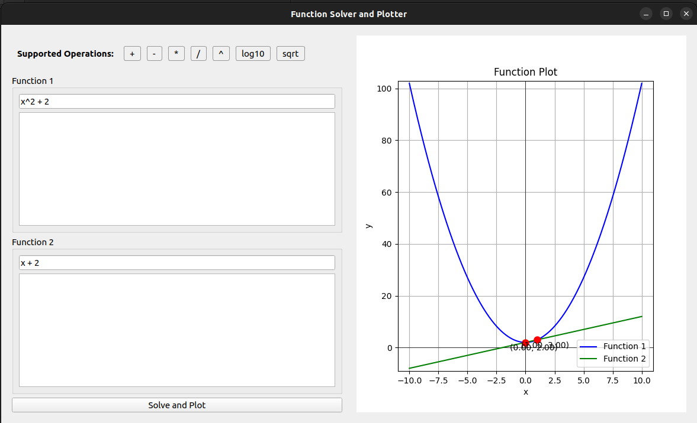
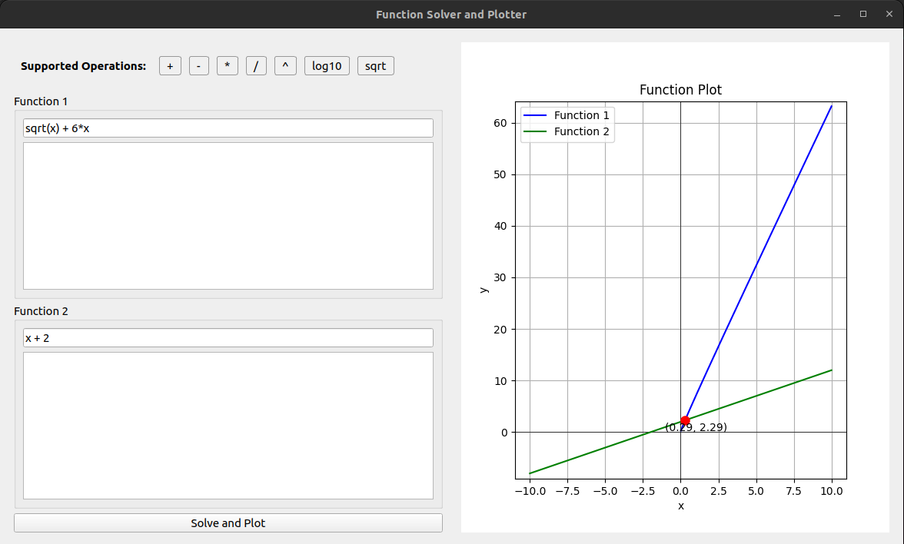
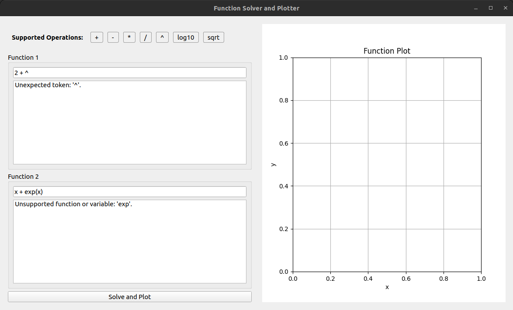

# equation-solver
A graphical program to solve simple mathematical equations.
Takes as input two equations of `x`, solves them, and plots the equations with their solutions.


- Supported Operations
`+ - / * ^ log10() sqrt()`

## Requirements
- Python 3.6 or higher (Python 3.10 recommended)

## Installation
1. Clone the repository
```bash
git clone https://github.com/Apolo151/equation-solver
cd equation-solver
```

2. Setup the virtual environment
```bash
python -m venv venv
source venv/bin/activate # or venv\Scripts\activate on Windows
```

3. Install the required packages
```bash
pip install -r requirements.txt
```

4. Run the program
```bash
python3 app.py # or python app.py
```

## Usage
1. Enter the two equations in the input fields
2. Click on the "Solve and Plot" button to solve the equations
3. The solutions will be displayed in the output plot

### Testing 

To run the tests, use the following command:
```bash
pytest tests/* --cov=solver --cov=parser --cov=plotter --cov-report=term-missing
```

## Examples

#### Correct





#### Incorrect



