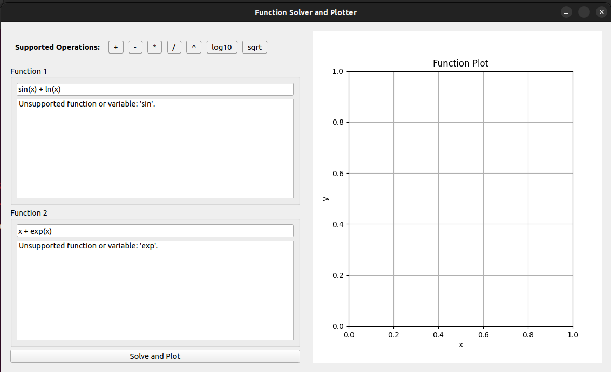

# Equation Solver 📈

[](https://www.python.org/downloads/)
[](https://opensource.org/licenses/MIT)

A graphical program to solve mathematical equations and visualize their intersections through plotting.
Takes as input two equations of `x`, solves them, and plots the equations with their solutions.


## Features ✨
- Graphical user interface (GUI) with input validation
- Supports equation solving and intersection point detection
- Interactive matplotlib plots embedded in the GUI
- Error handling with user-friendly messages
- Cross-platform compatibility (Windows/Linux)

## Supported Operations 🔢
| Operation      | Symbol/Function | Example           |
|----------------|-----------------|-------------------|
| Addition       | `+`             | `x + 3`           |
| Subtraction    | `-`             | `5 - x`           |
| Multiplication | `*`             | `2 * x`           |
| Division       | `/`             | `x / 4`           |
| Exponentiation | `^`             | `x^2`             |
| Square root    | `sqrt()`        | `sqrt(x + 1)`     |
| Logarithm base10| `log10()`       | `log10(2*x)`      |


## Requirements 📋
- Python 3.10+ (recommended)
- PySide2 (GUI framework)
- Matplotlib (Plotting)
- NumPy (Numerical operations)
- SciPy (Equation solving)
- SymPy (Symbolic mathematics)

## Installation
1. Clone the repository
```bash
git clone https://github.com/Apolo151/equation-solver
cd equation-solver
```

2. Setup the virtual environment
```bash
python -m venv venv
source venv/bin/activate # or venv\Scripts\activate on Windows
```

3. Install the required packages
```bash
pip install -r requirements.txt
```

4. Run the program
```bash
python3 app.py # or python app.py
```

## Usage
1. Enter the two equations in the input fields
2. Click on the "Solve and Plot" button to solve the equations
3. The solutions will be displayed in the output plot

### Testing 

To run the tests, use the following command:
```bash
pytest tests/* --cov=solver --cov=parser --cov=plotter --cov-report=term-missing
```

## Examples

#### Correct


#### Incorrect




