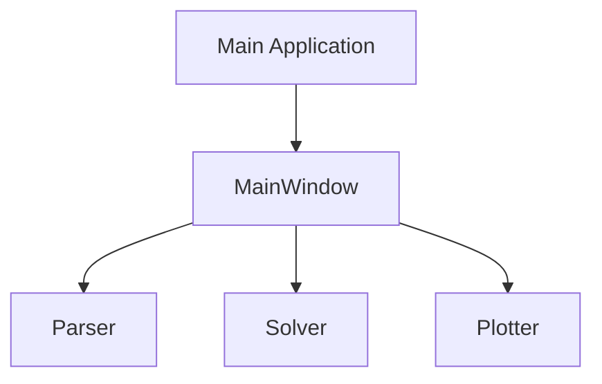
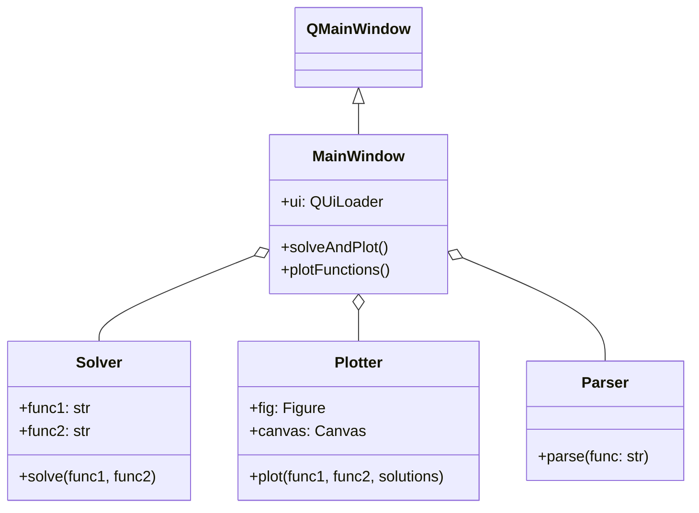
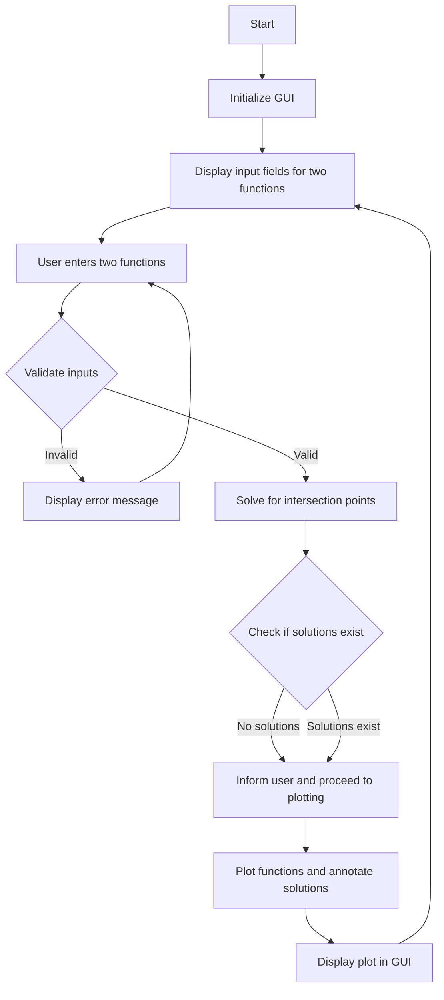

## Structure Chart

```mermaid
graph TD
    MainApplication[Main Application] --> MainWindow[MainWindow]
    MainWindow --> Parser[Parser]
    MainWindow --> Solver[Solver]
    MainWindow --> Plotter[Plotter]
```

## Class Diagram

```mermaid
classDiagram
    class QMainWindow
    class MainWindow {
        +ui: QUiLoader
        +solveAndPlot()
        +plotFunctions()
    }
    class Solver {
        +func1: str
        +func2: str
        +solve(func1, func2)
    }
    class Plotter {
        +fig: Figure
        +canvas: Canvas
        +plot(func1, func2, solutions)
    }
    class Parser {
        +parse(func: str)
    }
    QMainWindow <|-- MainWindow
    MainWindow o-- Solver
    MainWindow o-- Plotter
    MainWindow o-- Parser
```

## Flowchart

```mermaid
graph TD
    A[Start] --> B[Initialize GUI]
    B --> C[Display input fields for two functions]
    C --> D[User enters two functions]
    D --> E{Validate inputs}
    E -->|Invalid| F[Display error message]
    F --> D
    E -->|Valid| G[Solve for intersection points]
    G --> H{Check if solutions exist}
    H -->|No solutions| I[Inform user and proceed to plotting]
    H -->|Solutions exist| I
    I --> J[Plot functions and annotate solutions]
    J --> K[Display plot in GUI]
    K --> C
```